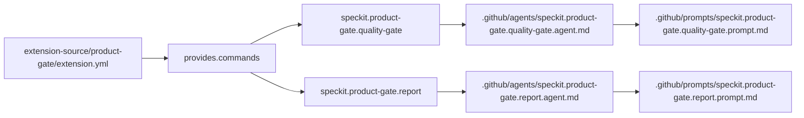
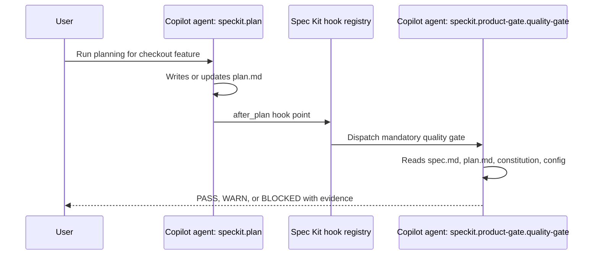
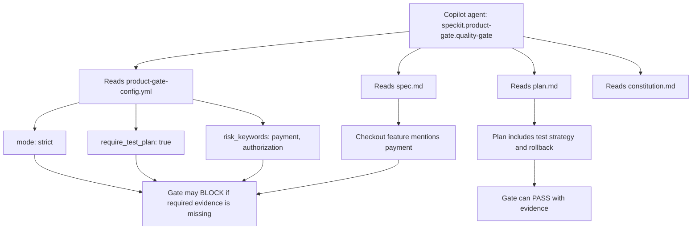
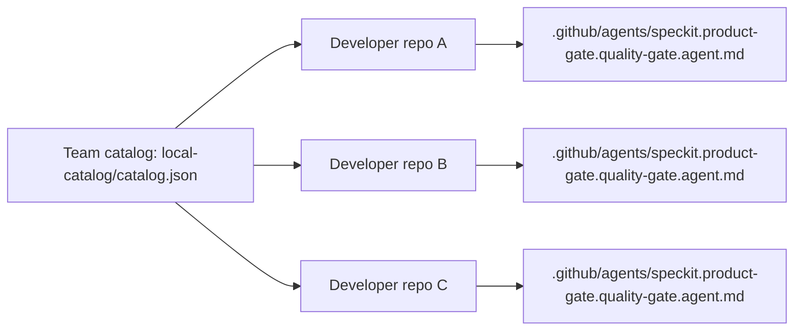
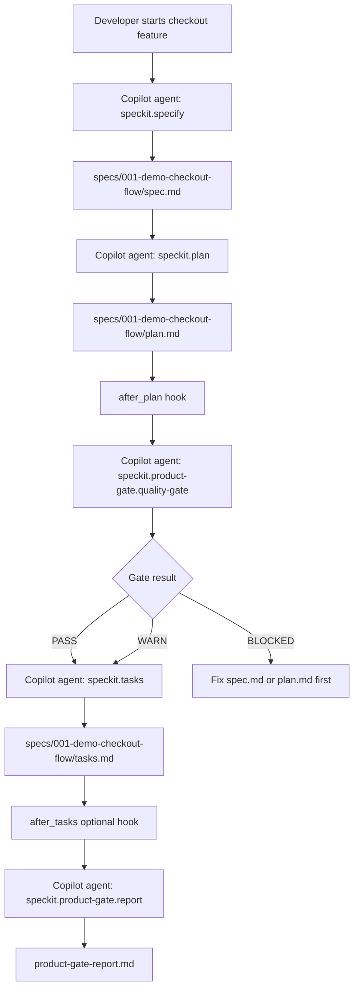

# Understanding Spec Kit Extensions With GitHub Copilot

This document explains Spec Kit extensions by walking through the `product-gate` extension in this POC.

The example assumes a project initialized for GitHub Copilot default agent mode:

```bash
specify init --here --integration copilot
```

In this mode, Spec Kit creates Copilot agent files under `.github/agents/` and companion prompt files under `.github/prompts/`.

## Feature Scenario Used Throughout

Specification : a Spec Kit extension is easiest to understand when we attach it to a real Copilot workflow. In this document, every extension feature is shown through one checkout feature and one Copilot-focused extension named `product-gate`.

**Example**

The `sample-project` has a checkout feature:

```text
sample-project/specs/001-demo-checkout-flow/
├── spec.md
├── plan.md
├── tasks.md
└── product-gate-report.md
```

The team wants Copilot to do two extra things while building that feature:

1. After the `speckit.plan` Copilot agent creates the technical plan, Copilot must run a product-readiness gate.
2. After the `speckit.tasks` Copilot agent creates tasks, Copilot may generate a product-readiness report.

That behavior is packaged as the `product-gate` Spec Kit extension.

## Extension Package Shape

Specification : a Spec Kit extension is a small installable package. In this Copilot example, the package contains the manifest that tells Spec Kit what to register, command markdown files that become Copilot agents, a config template that controls agent behavior, and an optional helper script.

**Example**

The extension source is:

```text
extension-source/product-gate/
├── extension.yml
├── product-gate-config.template.yml
├── commands/
│   ├── quality-gate.md
│   └── report.md
└── scripts/
    └── summarize-artifacts.sh
```

The package is installed with:

```bash
specify extension add --dev /Users/4nshuman/Development/speckit-extensions-poc/extension-source/product-gate
```

## Manifest-To-Copilot Registration

Specification : `extension.yml` is the contract between the extension package and Spec Kit. In this Copilot example, the manifest tells Spec Kit to turn two extension command files into two Copilot agents and two companion prompt files.

**Example**

The extension manifest declares the two Copilot agents this extension contributes:

```yaml
provides:
  commands:
    - name: "speckit.product-gate.quality-gate"
      file: "commands/quality-gate.md"
    - name: "speckit.product-gate.report"
      file: "commands/report.md"
```

When this is installed into a Copilot project, Spec Kit registers these as Copilot agent files:

```text
sample-project/.github/agents/speckit.product-gate.quality-gate.agent.md
sample-project/.github/agents/speckit.product-gate.report.agent.md
```

It also creates prompt files that point to those agents:

```text
sample-project/.github/prompts/speckit.product-gate.quality-gate.prompt.md
sample-project/.github/prompts/speckit.product-gate.report.prompt.md
```



## Reusable Copilot Agent Behavior

Specification : extensions help when a Copilot instruction should be reused across features or repos. In this example, the product-readiness review is not a one-off prompt typed into chat; it becomes a named Copilot agent that the team can install and run consistently.

**Example**

Without the extension, a developer has to remember to ask Copilot:

```text
Review the plan for missing acceptance criteria, missing rollback, missing test plan, and risky payment/auth changes.
```

With the extension, that review becomes a named Copilot agent:

```bash
copilot -p "" --agent speckit.product-gate.quality-gate
```

The instructions live in:

```text
extension-source/product-gate/commands/quality-gate.md
```

The installed Copilot agent lives in:

```text
sample-project/.github/agents/speckit.product-gate.quality-gate.agent.md
```

That means the behavior is reusable. The team does not need to rewrite the product-readiness prompt for every feature.

## File-Grounded Copilot Agent Output

Specification : an extension command can force Copilot to read the same Spec Kit artifacts every time and return a predictable result. In this example, the quality gate reads `spec.md` and `plan.md`, then returns `PASS`, `WARN`, or `BLOCKED` with evidence.

**Example**

The checkout feature has this requirement in `spec.md`:

```text
Given a duplicate submit request, when the request is replayed, then only one order is created.
```

The plan has this mitigation:

```text
The checkout endpoint validates ownership, creates an idempotency key, calls the payment provider, and persists the order in a transaction boundary.
```

The `speckit.product-gate.quality-gate` Copilot agent checks those files and produces a result like:

```markdown
## Product Gate Result

Status: PASS

## Evidence

- spec.md - duplicate submit acceptance criterion exists
- plan.md - idempotency key and transaction boundary are planned
- plan.md - rollback through feature flag is documented

## Gaps

- None
```

This is useful while building Copilot agents because the quality gate is not hidden in a human checklist. It becomes a Copilot-run agent with a stable name, stable files, and stable output expectations.

## Lifecycle Hooks In The Copilot Flow

Specification : hooks attach an extension agent to a specific point in the Spec Kit lifecycle. In this example, the `after_plan` hook makes Copilot run the product gate right after the `speckit.plan` agent creates or updates `plan.md`.

**Example**

The extension manifest registers this hook:

```yaml
hooks:
  after_plan:
    command: "speckit.product-gate.quality-gate"
    optional: false
```

The installed project records it in:

```text
sample-project/.specify/extensions.yml
```

So the Copilot flow is:



This helps because the gate is attached to the Copilot workflow. A developer does not need to remember to run it after every plan.

## Optional Copilot Follow-Up Agents

Specification : not every extension action has to block the workflow. In this example, the report agent is attached after task generation, but it is optional, so Copilot can ask whether the user wants the extra product-readiness report.

**Example**

The same extension registers this optional hook:

```yaml
hooks:
  after_tasks:
    command: "speckit.product-gate.report"
    optional: true
    prompt: "Generate a product-readiness report from the generated tasks?"
```

For the checkout feature, after `speckit.tasks` creates:

```text
sample-project/specs/001-demo-checkout-flow/tasks.md
```

Copilot can run:

```bash
copilot -p "" --agent speckit.product-gate.report
```

The output is:

```text
sample-project/specs/001-demo-checkout-flow/product-gate-report.md
```

In this POC, that report maps acceptance criteria to tasks:

```markdown
- Valid payment creates an order: covered by T004 and T005.
- Rejected payment preserves cart state: covered by T003 and T005.
- Duplicate submit creates one order: covered by T001, T004, and T005.
```

This helps Copilot agent building because the report is generated from the same artifacts Copilot just created. It gives the reviewer a compact PR-ready summary instead of forcing them to inspect every artifact manually.

## Project Config For Copilot Agent Behavior

Specification : extension config lets the same Copilot agent behave differently per project without editing the agent prompt. In this example, `product-gate-config.yml` tells the quality gate whether to run in strict mode, how many acceptance criteria are required, and which risk words matter.

**Example**

The project config is:

```text
sample-project/.specify/extensions/product-gate/product-gate-config.yml
```

Config used by the checkout project:

```yaml
mode: "strict"
minimum_acceptance_criteria: 3
require_test_plan: true
require_rollback_note: true

risk_keywords:
  - "migration"
  - "payment"
  - "authentication"
  - "authorization"
  - "data-loss"
```

For the checkout feature, `payment` and `authorization` appear in the spec/plan, so the Copilot quality gate treats them as risk areas.

If a team wants the same agent to be less strict in a local sandbox, they can use:

```text
sample-project/.specify/extensions/product-gate/product-gate-config.local.yml
```

Local override used by an individual developer:

```yaml
mode: "advisory"
```

The agent name does not change:

```bash
copilot -p "" --agent speckit.product-gate.quality-gate
```

Only its project-specific behavior changes.



## Catalogs For Approved Copilot Agent Distribution

Specification : catalogs let a team expose approved Spec Kit extensions by name. In this example, `product-gate` can be made discoverable so multiple Copilot projects install the same quality-gate agent package instead of copying prompts manually.

**Example**

The POC includes:

```text
local-catalog/catalog.json
```

That catalog exposes `product-gate` as an approved extension:

```json
{
  "extensions": {
    "product-gate": {
      "name": "Product Gate",
      "id": "product-gate",
      "version": "1.0.0"
    }
  }
}
```

The sample project points to the catalog with:

```text
sample-project/.specify/extension-catalogs.yml
```

That helps a Copilot-based team because the same approved agent package can be installed across many repos:

```bash
specify extension search product-gate
specify extension add product-gate
```



Every repo gets the same Copilot agent behavior, instead of each developer maintaining a separate prompt.

## Installed File Layout In A Copilot Project

Specification : after installation, a Spec Kit extension changes both Copilot-facing files and Spec Kit bookkeeping files. In this example, Copilot receives `.agent.md` and `.prompt.md` files, while Spec Kit records the extension, hooks, and config under `.specify/`.

**Example**

After installing `product-gate`, the sample project shows these extension-specific files:

```text
sample-project/
├── .github/
│   ├── agents/
│   │   ├── speckit.product-gate.quality-gate.agent.md
│   │   └── speckit.product-gate.report.agent.md
│   └── prompts/
│       ├── speckit.product-gate.quality-gate.prompt.md
│       └── speckit.product-gate.report.prompt.md
├── .specify/
│   ├── extensions.yml
│   └── extensions/
│       ├── .registry
│       └── product-gate/
│           ├── extension.yml
│           ├── product-gate-config.yml
│           └── commands/
│               ├── quality-gate.md
│               └── report.md
└── .vscode/
    └── settings.json
```

The important Copilot files are:

```text
.github/agents/*.agent.md
.github/prompts/*.prompt.md
.vscode/settings.json
```

The important Spec Kit extension files are:

```text
.specify/extensions/product-gate/
.specify/extensions/.registry
.specify/extensions.yml
```

## End-To-End Copilot Feature Flow

Specification : the extension becomes part of the normal Copilot-backed Spec Kit workflow. In this example, Copilot specifies, plans, gates, creates tasks, optionally reports, and only proceeds cleanly when the artifacts are good enough.

**Example**



This is the practical value of the extension:

- Copilot still builds the spec, plan, and tasks.
- The extension adds team-specific Copilot agents.
- Hooks put those agents at the right point in the Spec Kit lifecycle.
- Config lets the same agents behave differently per repo.
- Catalogs let a team reuse the same Copilot agents across projects.

## Commands To Try In This POC

Install into a real Copilot-initialized Spec Kit project:

```bash
specify init --here --integration copilot
specify extension add --dev /Users/4nshuman/Development/speckit-extensions-poc/extension-source/product-gate
```

Inspect registered Copilot agents:

```bash
find .github/agents -name 'speckit.product-gate*.agent.md' -print
find .github/prompts -name 'speckit.product-gate*.prompt.md' -print
```

Run the extension agents directly:

```bash
copilot -p "" --agent speckit.product-gate.quality-gate
copilot -p "" --agent speckit.product-gate.report
```

Inspect the installed extension state:

```bash
cat .specify/extensions/.registry
cat .specify/extensions.yml
cat .specify/extensions/product-gate/product-gate-config.yml
```
